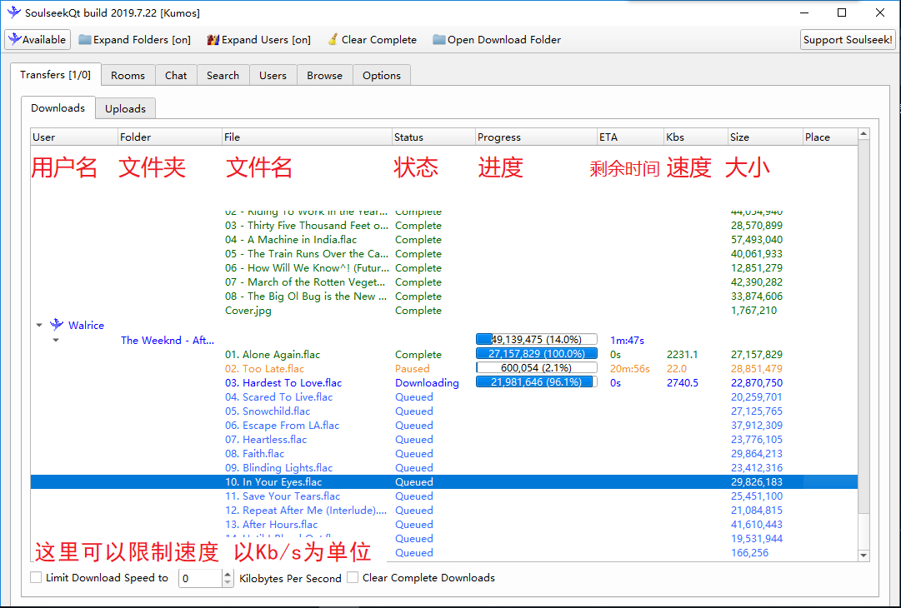

# 目录

{:.no_toc}
0. 
{:toc}

------

## 介绍

　　本人高二狗一枚，平时上学没有智能设备，只有mp3和kindle的陪伴。奈何国内平台下载音乐基本都要开会员，自己听的音乐略微小众，论坛上基本找不到资源，海盗湾也是难觅踪影。幸运的是，在冲浪过程中，发现了这样一款历史悠久却在国内鲜有人知的软件 **Soulseek** 。

>　　Soulseek is an ad-free, spyware free, just plain free file sharing network for Windows, Mac and Linux. Our rooms, search engine and search correlation system make it easy for you to find people with similar interests, and make new discoveries!
>
>　　Soulseek是一个无广告，无间谍软件，只是一个Windows，Mac和Linux上的的普通文件共享网络。我们的房间，搜索引擎和搜索关联系统使您可以轻松找到兴趣相似的人并进行新的探索！

　　与Bittorrent不同，Soulseek使用的协议是DirectP2P，即下载和上传不是同时由多个用户完成的，而是由单个用户完成（例如从网站下载文件就是这样）。与公共Trackers相比，安全性更高，文件不会因为版权问题而消失。当然，因为是用户自行上传，如果这个用户下线了，那就没有办法继续下载，而且音乐也不能保证完全高质量。不过可以通过过滤器来过滤掉低质量的音乐。

　　它相比于torrent来说，更加适用于寻找音乐的人使用，因为Soulseek专注于小文件的分享，理论上可以分享任何文件，不过基本没有人分享除了音乐以外的东西。在Soulseek上你可以见到库存成千上万的大佬，这时就可以将大佬添进列表里，以后慢慢找资源。

　　当然因为在国内不太为人知，所以华语歌曲寻找的难度可能高一些，需要中文英文都试一试，或者找一些国人大佬然后在他们的库里搜索。不常听华语歌曲，无法提出有用的意见，见谅。

典型大佬
{:.figure}

　　还有个需要注意的：Soulseek没有官方移动端，只有一个很久没有更新的非官方安卓端Goseek，据说只支持到Andriod 7，Kumo我没有安卓机子，不太清楚。

**优点**：

1. 可以找到很小众或者高质量的音乐资源（比如Bandcamp上的独立音乐）
2. 正常情况下下载速度可以接受

**缺点**：

1. 没有中文界面
2. 亚太地区的歌曲寻找较困难，歌曲没有统一命名标准，有些英文，有些原文
3. 下载速度基本取决于分享用户的上传速度，想要获得最佳下载体验还是要科学上网

　　废话不多说，下面介绍一下下载和一些使用方法。

------

## 下载

官网：http://www.slsknet.org/news/node/1 （需科学上网）

备用：64位：[蓝奏云](https://kumos.lanzous.com/ibnhz3e)    32位：[蓝奏云](https://kumos.lanzous.com/ibnhyoj)

自行选择系统版本（无移动端）
{:.figure}

**安装方法与一般程序无异，这里不再赘述。**

## 基本使用

 第一次使用，会让你注册/登录账号。

窗口名称可能不同
{:.figure}

输入用户名和密码注册即可（注意密码没有*保护）

然后会提示你选择一个文件夹用来分享，我个人建议有能力还是设置一下，不要总想着白嫖。

接下来就是主界面

比较有用的就是传输列表、房间、和搜索了，下面逐一介绍。

### 界面

#### 传输列表

很简洁明了的UI，浅显易懂，没什么好说的。

PS：因为人在外地，所以网速不太理想，正常速度应该不止2mb/s

#### 房间

#### 搜索

## 进阶

### 过滤器

